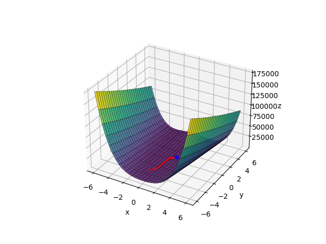
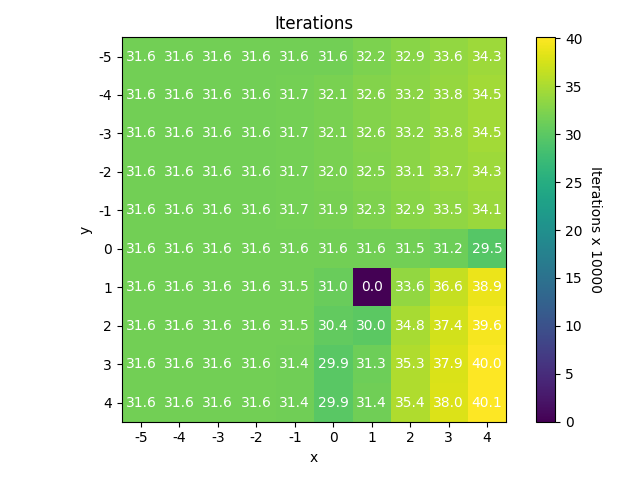

##### **Mikalai Stelmakh 316951**

# WSI Lab 1 - przeszukiwanie przestrzen

## **Zadanie**

Zaimplementowanie metody najszybszego spadku gradientu i metody Newtona dla następującej finkcji celu:

```
f(x,y) = (1-x)^2 + 100(y-x^2)^2 ,  -5 <= x <= 5 , -5 <= y <= 5
```

## **Uruchomenie programu**

```
python3 minimize_rosenbrock.py [--method METHOD] [--graph] X Y step iterations epsilon
```

Żeby dowiedzieć się więcej na temat argumentów należy użyć flagi `"-h"`.

## **Wyniki**

### Metoda najszybszego spadku gradientu

Przykładowe działanie metody dla punktu początkowego [-4, -4], β = 0,0001 i liczby iteracji = 10000:


- **Działa poprawnie tylko dla stosunkowo małego współczynniku β (< 0,0001).** </br>
  Dzieje się tak dlatego, że dla dłuższego kroku algorytm "przeskakuje" właściwy punkt i nigdy nie trafia w minimum funkcji.
- **Z powodu na małą długość kroku algorytm potrzebuje stosunkowo wielu iteracji dla znalezienia włąściwego punktu.** </br>

Wykres pokazujący potrzebną liczbę iteracji dla znalezienia punktu mniejszego niż ε dla różnych punktów początkowych (β = 0.0001, ε = 10^-12)


### Metoda Newtona

Przykładowe działanie metody dla punktu początkowego [-2, -2], β = 1 i liczby iteracji = 3:
 </br>

Zgodnie z wykresem, używając metody Newtona możemy znaleźć minimum funkcji w znacznie mniejszej ilości iteracji niż używając metody najszybszego spadku gradientu. Kompensowane to jest ilością obliczeń: </br> metoda najszybszego spadku - gradient oraz mnożenie wektorów, </br>
metoda Newtona - gradient, hesjan oraz mnożenie macierzy przez wektor, </br>
z tego możemy wywnioskować, że: </br>
- **Wykona się znacznie szybciej, ale kosztem większych obliczeń, niż metoda najszybszego spadku gradientu.** </br>

Wykres pokazujący potrzebną liczbę iteracji dla znalezienia punktu mniejszego niż ε dla różnych punktów początkowych (β = 1, ε = 10^-12)


